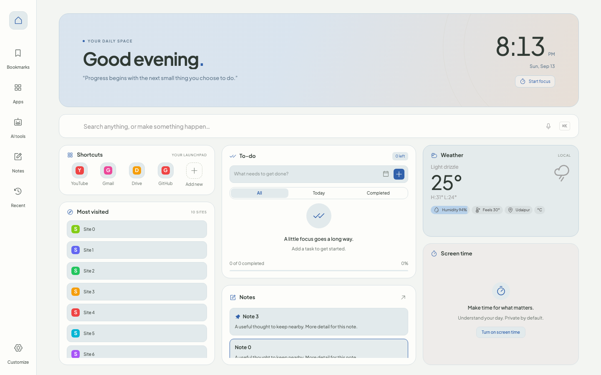
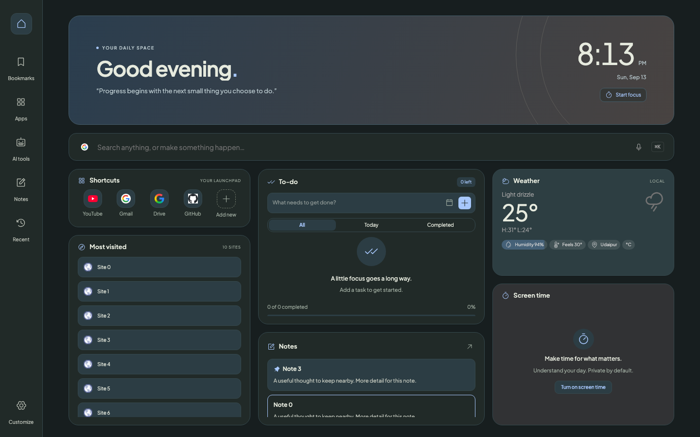
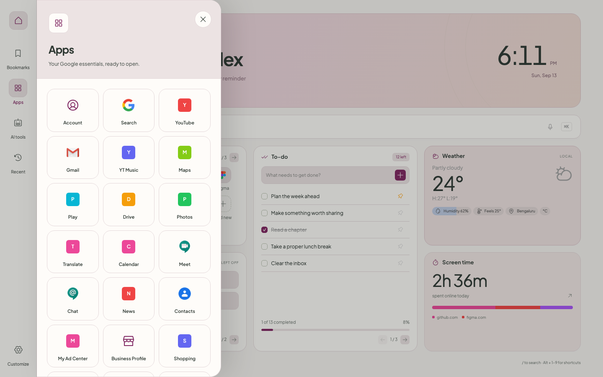
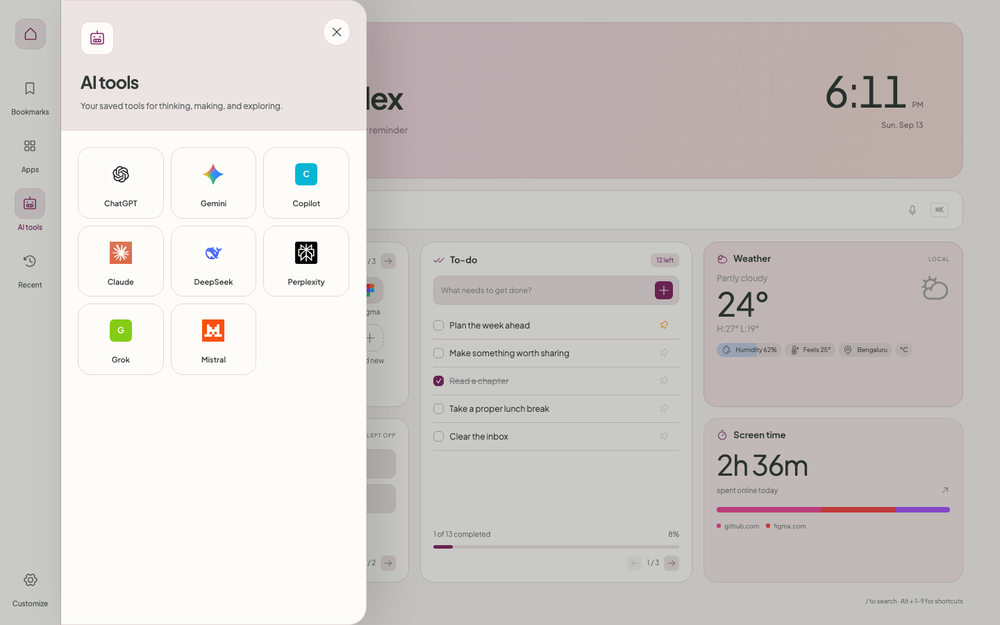
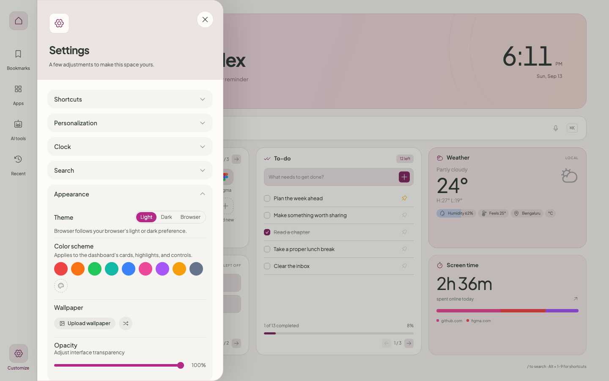
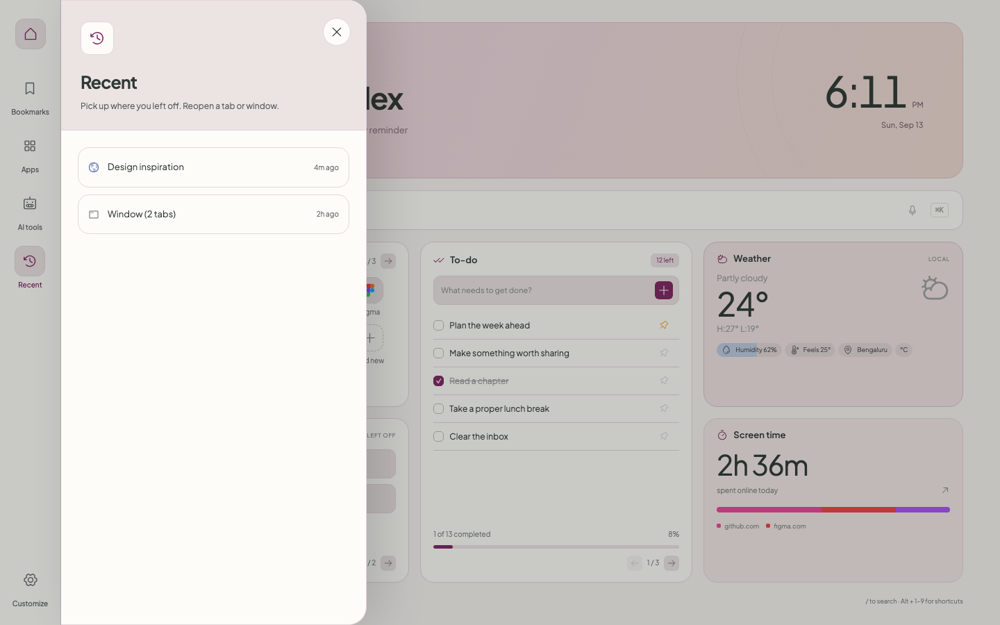
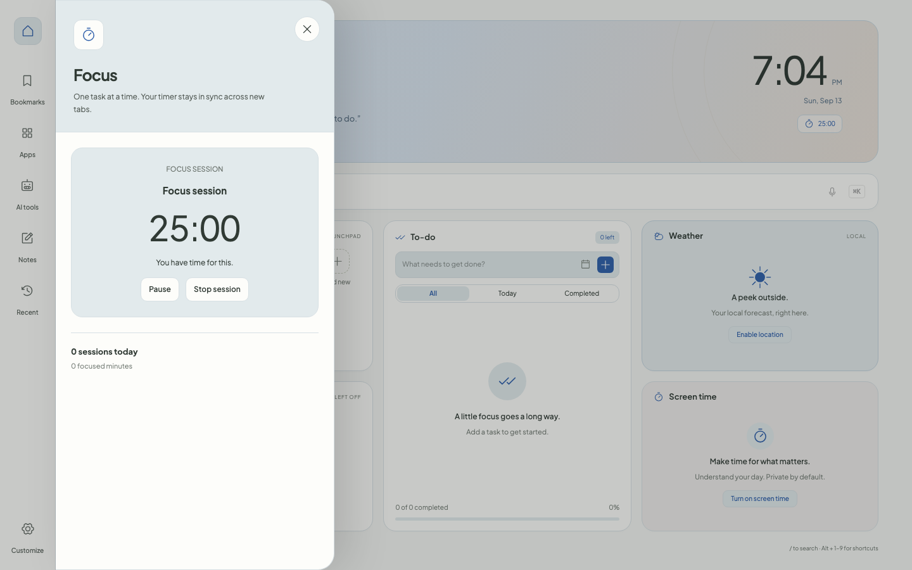
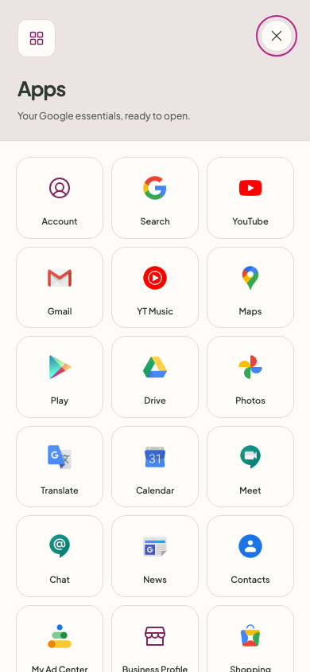

# Daily Workspace

*A calm, all-in-one New Tab dashboard for Chromium browsers.*


[Features](#-features) • [Installation](#-installation) • [Development](#-development) • [Permissions](#-permissions) • [Privacy](#-privacy) • [Changelog](./CHANGELOG.md) • [Contributing](#-contributing) • [License](#-license)



Daily Workspace replaces the browser's New Tab page with a single, organized home base: a bento-style dashboard of shortcuts, tasks, notes, weather, and screen time, reached through a compact icon rail and quick keyboard-driven search — all backed by local storage only.

> **New in 0.2.0** — a tasks/note bubble and focus timer on the pages you browse, a rebalanced layout with To-do and Notes as the large cards, the date and temperature merged into the welcome strip, and screen-time details without a tap. See the [changelog](./CHANGELOG.md) for the full list and upgrade notes.


## Features


### Dashboard cards

- **Shortcuts** — a personal launchpad of pinned links with favicons.
- **To-do** and **Notes** — the two large cards by default. Quick add, due dates, daily/weekly repeat, pinning and filters on one side; autosaving notes on the other. Deletions and completions can be undone from a toast.
- **Screen time** — a private, local-only breakdown of time spent per site, today or over the past week, with every figure on the card rather than behind a tap.
- **Most visited** — your top sites, surfaced automatically and laid out to fit the card (a row of tiles when wide, a list when narrow), one click from becoming a shortcut.
- **Dashboard layout editing** — drag cards (or use the keyboard) to reorder them, and give any two of them double height.

The **welcome strip** across the top carries the greeting, a quote, the time with today's date and a day-progress bar beneath it, and — alongside — the current temperature and a button to start a focus session. Hover the reading for conditions, "feels like", the high/low and your location; click it to switch °C/°F.


### Quick access sidebar

An icon rail along the left edge opens focused side panels without leaving the dashboard:



- **Bookmarks** — browse and manage your bookmarks in list or grid layout.
- **Apps** — one-click access to Gmail, Drive, Calendar, Maps, and other Google services.
- **AI tools** — shortcuts to ChatGPT, Gemini, Claude, Perplexity, and more, fully editable.
- **Notes** — the full notes list, editable in place.
- **Recent** — reopen recently closed tabs in one click.
- **Workspaces** — save the tabs you're working with under a name, and reopen them together in a new window later.
- **Customize** — every setting below, without ever leaving the new tab page.


### Search & quick commands

- One search bar for Google, DuckDuckGo, Bing, Brave Search, YouTube, or Wikipedia, with search suggestions and voice input.
- Type `@` to jump to a shortcut, `t:` to add a to-do, or `b:` to search bookmarks — all without leaving the search bar.
- `⌘K` / `Ctrl K` or `/` focuses search from anywhere on the page.
- Search covers **your own tasks and notes** as well as open tabs, bookmarks, shortcuts, and AI tools. Picking a task jumps to it in the To-do card; picking a note opens it.


### Capture from any page

Browser-wide shortcuts that work while you're on any website, not just the new tab. Each one records the page it came from, so a captured task or note links back to its source.


| Shortcut      | What it does                                          |
| ------------- | ----------------------------------------------------- |
| `Alt Shift T` | Save the current page as a task                       |
| `Alt Shift N` | Save your text selection (or just the page) as a note |
| `Alt Shift L` | Save the current page as a shortcut                   |
| `Alt Shift K` | Open the dashboard with search focused                |


Remap or disable any of these at `chrome://extensions/shortcuts`.

### On every page
On by default, and one switch in Settings → Productivity turns it off. A collapsed handle sits on the edge of any site you visit:

- **Tasks** — add and tick off items without leaving the page.
- **Note** — type into your pinned note; it saves as you go.
- **Focus timer** — top-right. Between sessions it's a faint icon that starts a 25-minute session in one click; during one it shows a progress ring with pause/resume.
- Designed to stay out of the way: small and muted until you point at it, positioned *under* a site's own dialogs, dismissed by `Esc` or any click outside, hideable per-site, hidden in fullscreen, and never shown on sign-in or checkout pages.

### Focus

- A lightweight focus timer next to the clock, optionally linked to a specific task, with pause/resume, breaks, and a session history that survives browser restarts.


### Personalization

- Light, dark, or browser-matched theme; a nine-color accent palette plus a custom color picker that tints cards, highlights, and controls.
- Upload your own wallpaper (or shuffle a random one), with an interface opacity slider.
- Digital or analog clock, 12/24-hour format, a custom greeting or message, and a daily motivational quote.
- Toggle every card and sidebar section on or off independently.


### Backup & reset

- Export or import your entire setup as a file, or reset everything back to defaults, from Settings → Data.


## More screenshots



## Installation

Daily Workspace isn't published to any add-on store — it's built and loaded as an unpacked/temporary extension.

1. **Clone the repository**:
  ```bash
   git clone https://github.com/adhikari-dikshant/tab-extension.git
   cd tab-extension
   npm install
  ```


### Chromium-based browsers (Chrome, Edge, Brave, Opera)

1. **Build**:
  ```bash
   npm run build
  ```
2. **Load it**:
  - Open `chrome://extensions` (or the equivalent `edge://extensions`, `brave://extensions`).
  - Turn on **Developer mode**.
  - Click **Load unpacked** and select the generated `dist` folder.
  - Open a new tab to see it in action.


### Firefox

Firefox doesn't support Manifest V3 service workers, so it needs a small manifest patch on top of the same build — `npm run build:firefox` handles that for you:

1. **Build**:
  ```bash
   npm run build:firefox
  ```
   This runs the normal build, then clones it into `dist-firefox/` with a Firefox-compatible `background` key and `browser_specific_settings`.
2. **Load it**:
  - Open `about:debugging#/runtime/this-firefox`.
  - Click **Load Temporary Add-on…** and select `dist-firefox/manifest.json`.
  - Open a new tab to see it in action.
  > [!NOTE]
  > Temporary add-ons are removed when Firefox restarts, so you'll need to reload it each session during development. The bundled `browser_specific_settings.gecko.id` is a placeholder — replace it with your own before submitting anywhere permanent, such as addons.mozilla.org.


## Development

Built with React 19, TypeScript, Vite, Tailwind CSS v4, [CRXJS](https://crxjs.dev/vite-plugin), Radix UI primitives, and Phosphor icons.

```bash
npm install         # install dependencies
npm run dev         # start Vite in watch mode — load the dist folder as an unpacked extension once, then it hot-reloads
npm run build       # type-check and produce a Chromium production build in dist/
npm run build:firefox  # build, then clone it into dist-firefox/ with a Firefox-compatible manifest
npm run lint        # run ESLint
npm test            # run the productivity/background unit tests
```


## Permissions


| Permission                    | Type                     | Why it's needed                                                                                                                                                                               |
| ----------------------------- | ------------------------ | --------------------------------------------------------------------------------------------------------------------------------------------------------------------------------------------- |
| `storage`, `unlimitedStorage` | Required                 | Save your settings, shortcuts, tasks, and notes locally.                                                                                                                                      |
| `alarms`                      | Required                 | Wake the background service worker for scheduled reminders and screen-time tracking.                                                                                                          |
| `activeTab`                   | Required                 | Read the current page's title and URL when you press a capture shortcut. Granted by that keypress alone — it gives no standing access to your tabs, and nothing is read until you ask for it. |
| `scripting`                   | Required                 | Read your text selection on the page you're capturing from, so it becomes the note's body. Capture still works if this fails; you just get an empty note.                                     |
| `favicon`                     | Required (Chromium only) | Show cached site icons next to shortcuts and most-visited sites. Firefox has no equivalent API and ignores this permission — icons fall back to a public favicon service there instead.       |
| `notifications`               | Optional                 | Desktop reminders for due tasks and finished focus sessions.                                                                                                                                  |
| `bookmarks`                   | Optional                 | Power the Bookmarks panel.                                                                                                                                                                    |
| `tabs`                        | Optional                 | Screen time tracking and saving/restoring workspaces.                                                                                                                                         |
| `idle`                        | Optional                 | Pause screen-time tracking while the browser is idle.                                                                                                                                         |
| `sessions`                    | Optional                 | Reopen recently closed tabs.                                                                                                                                                                  |
| `topSites`                    | Optional                 | Populate the Most Visited card.                                                                                                                                                               |
| `<all_urls>`                  | Required                 | Show the tasks/note bubble and focus timer on the pages you visit, which is on by default. Chrome shows this as "Read and change all your data on all websites" at install. Nothing on those pages is read or sent anywhere — the bubble only renders your own tasks and notes. Turning the bubble off in Settings removes it from every page; restricting site access in Chrome's extension settings stops it too. |


Optional permissions are requested only when you turn on the matching feature, and each can be revoked at any time from your browser's extension settings.

## Your data

Everything is stored locally, and the data model is versioned so upgrades and restores stay predictable.

- **Export** writes a self-describing JSON file — it records its schema version, when it was made, and which installation made it. Older backups taken before this format existed still import.
- **Import** offers two modes. **Merge** keeps what you have and only updates a task, note or link when the file's copy is genuinely newer, matching on content so the same record carried between browser profiles doesn't duplicate. **Replace** restores a snapshot wholesale. Nothing is deleted until you confirm, and a failed write rolls back.
- **Storage tiers** decide what travels. Your tasks, notes, links and settings are *portable*. Screen-time history is *device-only* — it describes one machine, so it's left out of an export unless you tick the box, and never merged in from elsewhere. Caches are *derived* and never exported.
- `chrome.storage.sync` is deliberately unused: its 100 KB total / 8 KB per-item quota can't hold note bodies or screen-time history. The export file is how you move between profiles.


## Privacy

**No accounts, no servers of ours, no analytics.** Your settings, shortcuts, tasks, notes, workspaces, and screen-time history live in `chrome.storage.local` on your own machine, and nothing about your usage is collected or sent anywhere.

Three features do make requests to third parties, directly from your browser. They are listed here in full:


| Feature            | What is sent                                    | Where                                                                                  | When                                                                                                                                  |
| ------------------ | ----------------------------------------------- | -------------------------------------------------------------------------------------- | ------------------------------------------------------------------------------------------------------------------------------------- |
| Weather            | Your latitude and longitude                     | [Open-Meteo](https://open-meteo.com), [BigDataCloud](https://www.bigdatacloud.com)     | Only after you grant the browser's geolocation prompt.                                                                                |
| Search suggestions | What you type in the search bar                 | Your selected search engine, or Wikipedia if you decline that engine's host permission | Only while **Search Suggestions** is on. Turn it off in Settings → Search.                                                            |
| Site icons         | The hostname of a shortcut or most-visited site | Google's public favicon service                                                        | Only as a fallback. Chrome serves icons from its own cache first; Firefox has no equivalent API, so it goes straight to the fallback. |


Captured pages are a local matter: pressing a capture shortcut stores that page's title and URL in `chrome.storage.local` and sends nothing anywhere.

None of these requests include an identifier for you or your installation, and no response is shared onward. The Firefox build declares exactly these flows in its manifest (`websiteActivity` required, `locationInfo` and `searchTerms` optional) — see `scripts/build-firefox.mjs`.

## Contributing

Contributions are welcome! Please read [CONTRIBUTING.md](./CONTRIBUTING.md) before opening a pull request, then:

1. Fork the repository.
2. Create a branch: `git checkout -b feature/your-feature`.
3. Commit your changes: `git commit -m 'Add your feature'`.
4. Push the branch: `git push origin feature/your-feature`.
5. Open a pull request.

Please also review our [Code of Conduct](./CODE_OF_CONDUCT.md).

## Acknowledgements

The dashboard concept was inspired by the open-source [Material You New Tab](https://github.com/prem-k-r/MaterialYouNewTab) project. Daily Workspace is an independent, from-scratch implementation — it shares no code with that project.

## License

This project is licensed under the GNU General Public License v3.0 (GPL-3.0). See the [LICENSE](./LICENSE) file for details.